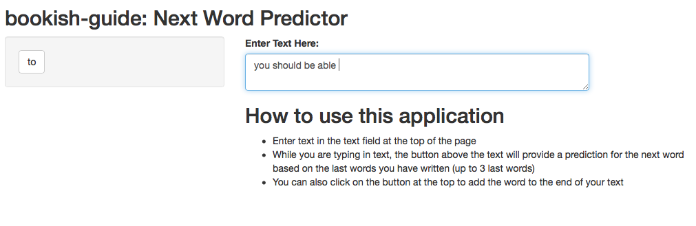

bookish-guide: Next Word Predictor
========================================================
author: Ivan Jennings
date: 31/05/21
autosize: true

What is it?
========================================================

bookish-guide is the name of the online app which provides a prediction for the next word as you are typing.

- Prediction Dynamically Updates
- Easily add the predicted word to your text
- Efficient model

Prediction Model
========================================================

- The prediction model uses data sourced from blogs, twitter and news sites
- The data is then sorted into a corpus document in R before being cleaned and "N-Grams" are created and sorted.
- Using the backoff method, the next word is predicted based on the previous words entered by the user.

```r
corpus <- corpus(x)
tokens <- tokens(corpus)
tokens2 <- tokens(tokens, remove_numbers=TRUE, remove_punct=TRUE, remove_symbols=TRUE, remove_url=TRUE) %>%
  tokens_remove(badwords$txt)
dfm <- tokens2 %>% dfm()
bigrams <- tokens2 %>% tokens_ngrams(2) %>% dfm()
```
User Interface
========================================================



- The application has a simple, clean interface and includes instructions for the user.
- Enter text and it will start providing predictions dynamically.

Final Notes
========================================================

- Jump in and check out my app!
- The source code is available here https://github.com/ivanjjj/bookish-guide
- The app is available here https://ivanjjj.shinyapps.io/bookish-guide/
